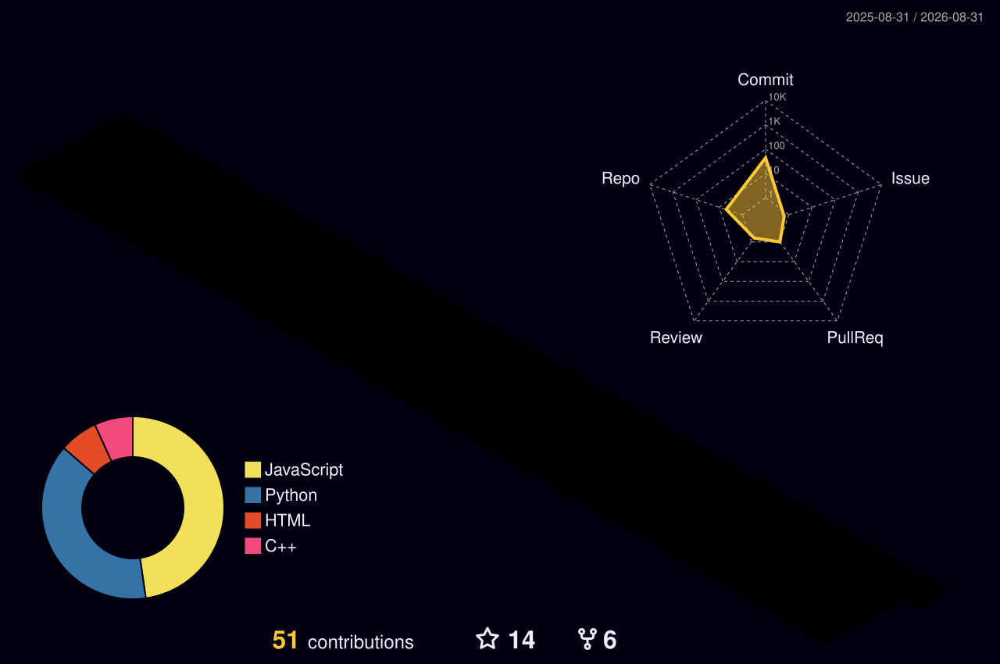

<div align="center">


<a href="https://git.io/typing-svg">
  
</a>

<p>
  
  <a href="https://github.com/MartinCrespoC?tab=followers"></a>
  <a href="https://www.linkedin.com/in/jmartincc/"></a>
  
</p>

</div>

## ◈ /ABOUT

```bash
$ whoami
> Juan Martín Crespo Calderón — IT Strategy & Innovation
> Guadalajara, MX · 15+ years driving digital transformation

$ cat /focus
> ServiceNow · SAP · GenAI (Vertex AI) integration
> Optimizing business processes through intelligent automation
> Side quests: autonomous AI agents & LLM inference (C++ / llama.cpp)

$ systemctl status crespo.service
> ● active (running) — ServiceNow Consultant @ Nadro
> ● open to collaboration & innovation projects
```

<div align="center"></div>

## ◈ /TECH ARSENAL

<div align="center">
  <a href="https://skillicons.dev">
    
  </a>
  <br/>
  <a href="https://skillicons.dev">
    
  </a>
</div>

<div align="center"></div>

## ◈ /NEURAL METRICS

<div align="center">
  
  
</div>

<div align="center">
  
</div>

<div align="center"></div>

## ◈ /CONTRIBUTION CONSTELLATION — 3D

<div align="center">
  
</div>

<div align="center"></div>

## ◈ /ACTIVITY STREAM

<div align="center">
  
</div>

<div align="center"></div>

## ◈ /FEATURED SYSTEMS

<div align="center">
  <a href="https://github.com/MartinCrespoC/QuantumLeap---Llama.cpp-TurboQuant">
    
  </a>
  <a href="https://github.com/MartinCrespoC/Security-Team---Workspace-">
    
  </a>
  <a href="https://github.com/MartinCrespoC/pentagi">
    
  </a>
</div>

<div align="center"></div>

## ◈ /CONTRIBUTION SNAKE

<div align="center">
  <picture>
    <source media="(prefers-color-scheme: dark)" srcset="https://raw.githubusercontent.com/MartinCrespoC/MartinCrespoC/output/github-snake-dark.svg"/>
    <source media="(prefers-color-scheme: light)" srcset="https://raw.githubusercontent.com/MartinCrespoC/MartinCrespoC/output/github-snake.svg"/>
    
  </picture>
</div>

<div align="center"></div>

## ◈ /TROPHY VAULT

<div align="center">
  
</div>

<div align="center"></div>

## ◈ /RANDOM TRANSMISSION

<div align="center">
  
</div>


